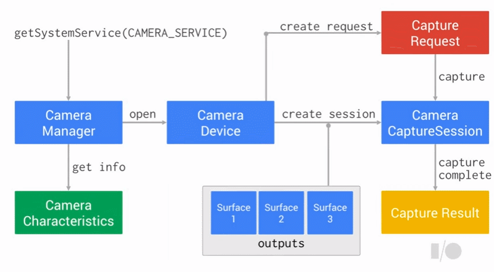
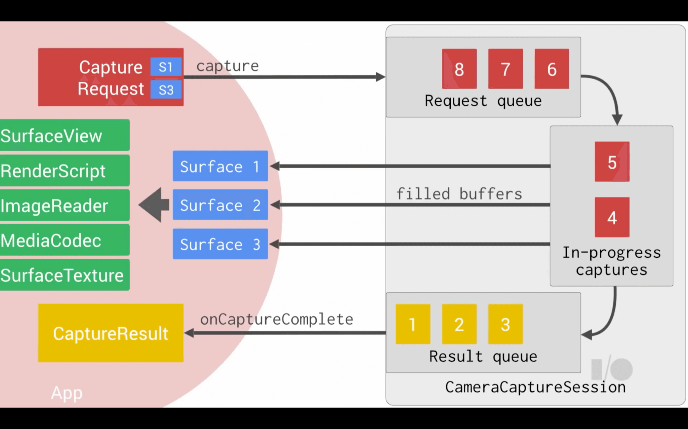

# Camera2 API





* **CamaraManager**
  * 시스템 서비스.
  * 사용 가능한 카메라, 카메라 기능들을 쿼리할 수 있고 카메라를 열 수 있음
* **CameraCharacteristics**
  * 카메라의 속성을 담고 있는 객체
  * 전/후면, 플래시 지원여부 등등
* **CameraDevice**
  * 카메라 객체
* **CameraRequest**
  * 촬영이나 미리보기를 요청할 때 쓰이는 객체.
  * 카메라 설정 변경할 때도 사용
* **CameraCaptureSession**
  * CaptureRequest를 보내고 카메라 하드웨어에서 결과를 받을 수 있는 세션.
  * 만들기 위해서는 camera device + surface 필요
  * surface는 camera device에서 사용 가능한 포맷과 크기가 일치하도록 미리 설정되어함.
  * 대상 surface는 SurfaceView, SurfaceTexture via Surface(SurfaceTexture), MediaCodec, MediaRecorder, Allocation, and ImageReader등 클래스들을 얻을 수 있음.
* **CaptureResult**
  * CaptureRequest의 결과. 이미지의 메타데이터도 가져올 수 있음.


## Camera2 활용순서

1. 권한을 먼저 물어봐야만 한다. 그렇지 않으면 모든 카메라 관련 로직에서 Permission Exception 발생

2. System Service를 통해 CameraManager를 가져온다.

   ```kotlin
   val manager = activity.getSystemService(Context.CAMERA_SERVICE) as CameraManager
   ```

   * manager를 통해 카메라 식별자들을 가져올 수 있음. (탑재된 카메라의 수에 따라 개수가 다름)

     ```kotlin
     val camaraIds: Array<String> = manager.cameraIdList
     // ["0", "1", "2"] 처럼 숫자인 문자열 배열이 떨어짐
     ```
* manager를 통해 카메라의 속성들을 갖고있는 객체를 가져올 수 있음.
  
     ```kotlin
     val characteristics: CameraCharacteristics = manager.getCameraCharacteristics(cameraId)
     
     characteristics.get(CameraCharacteristics.LENS_FACING_FRONT)
     characteristics[CameraCharacteristics.LENS_FACING_FRONT]
     // get을 구현해뒀기 때문에 위 같은 방식으로 해당 카메라의 속성 정보를 꺼낼 수 있음.
     ```
   
     * | 속성명 (CameraCharacteristics)  | 속성 정보                                                    | 타입                   | 비고                |
       | ------------------------------- | ------------------------------------------------------------ | ---------------------- | ------------------- |
       | LENS_FACING_FRONT               | 해당 카메라가 전면 카메라인지                                | Boolean                | 아니면 null 반환    |
       | LENS_FACING_BACK                | 해당 카메라가 후면 카메라인지                                | Boolean                | 아니면 null 반환    |
       | SCALER_STREAM_CONFIGURATION_MAP | 해당 카메라 장치에서 지원하는 모든 출력 형식(각 형식에 대한 크기) 목록 | StreamConfigurationMap |                     |
       | SENSOR_ORIENTATION              | 출력 이미지를 올바른 방향으로 돌리기 위해 필요한 각도        | Int                    | 카메라 당 고정 값임 |

