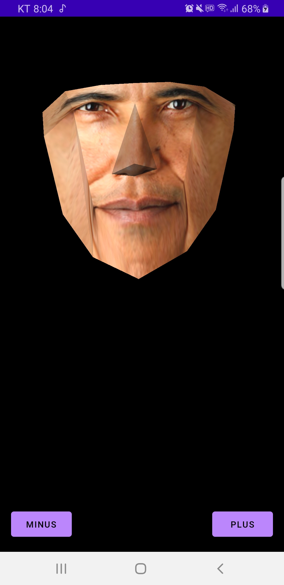
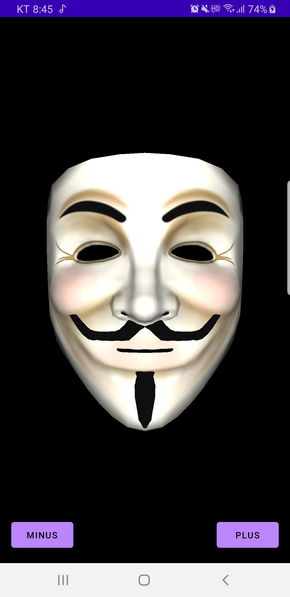
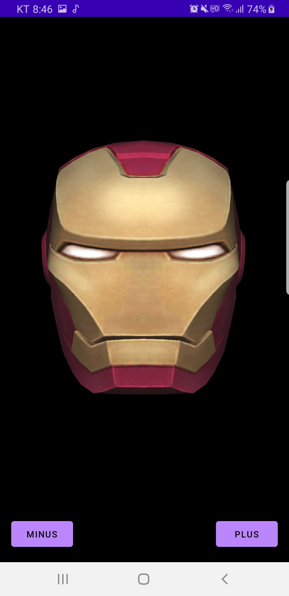

# Rajawali Guide

## Rajawali 라이브러리를 사용해서 안드로이드에 지구 돌아가는 모델을 렌더링 해본다.


### 의존성 추가

```groovy
implementation 'org.rajawali3d:rajawali:1.1.970'
```


### Renderer class를 상속받아 구현한다.

```kotlin
class SampleRajawaliRenderer(context: Context) : Renderer(context) {
    override fun initScene() { }

    override fun onOffsetsChanged(
        xOffset: Float,
        yOffset: Float,
        xOffsetStep: Float,
        yOffsetStep: Float,
        xPixelOffset: Int,
        yPixelOffset: Int
    ) { }

    override fun onTouchEvent(event: MotionEvent?) { }
}
```


### 멤버 변수로 조명과 구 객체를 만들어 둔다.

```kotlin
private val directionalLight = DirectionalLight(1.0, 0.2, -1.0).apply {
    setColor(1.0f, 1.0f, 1.0f)
    power = 2f
}
private val earthSphere = Sphere(1f, 24, 24)
```

* DirectionalLight의 생성자에는 어느 좌표로부터 빛이 내리 쬐는지를 정한다.
  * Color의 경우 디폴트가 흰색이다 (1.0, 1.0, 1.0)
  * power에 따라서 빛의 세기가 달라진다.
* earthSphere는 단순히 구 객체를 만든다.
  * 파라미터로는 반지름 길이, 가로로 쪼개져있는 개수, 세로로 쪼개져있는 개수를 의미한다.
  * 쪼개져 있는 개수가 많을 수록 더 원에 (구에) 가까워진다.
  * Sphere 객체는 Material 객체 세팅이 필요하다. (이후에 세팅 코드)


### initScene() 메서드를 구현한다.

```kotlin
override fun initScene() {
    currentScene.addLight(directionalLight)

    val earthTexture = Texture("Earth", R.drawable.earthtruecolor_nasa_big)
    val material = Material().apply {
        enableLighting(true)
        diffuseMethod = DiffuseMethod.Lambert()
        colorInfluence = 0f
        addTexture(earthTexture)
    }
    earthSphere.material = material
    currentScene.addChild(earthSphere)
    currentCamera.z = 5.0
}
```

[Earth Texture 다운로드 주소](http://www.clintonmedbery.com/wp-content/uploads/2015/04/earthtruecolor_nasa_big.jpg)

* resource id로부터 텍스쳐 객체를 생성한다.
* 물체의 표면에서의 diffuse(빛의 확산)을 명시한다.
  * 빛의 입사 광선은 하나의 각도로만 반사 되는 것이 아니고 여러 각도에서 반사 되기 때문이다.
* 색상 영향은 (color Influence) 색의 영향이 얼마나 큰지를 나타낸다.
  * setColorInfluence 메서드는 setInfluence()와 함께 쓰여야 한다.
* addTexture로 해당 물질의 텍스처를 추가한다.
* 위에서 만든 Material 객체를 Sphere에 추가한다.
* Sphere 객체를 화면에 나타내기 위해 currentScene에 추가한다. 


### layout에 SurfaceView를 배치한다. 

* 이 SurfaceView는 android 패키지에 있는 SurfaceView가 아니다.
* rajawali 패키지에 존재하는 SurfaceView를 배치해야한다.

```xml
<org.rajawali3d.view.SurfaceView
    android:id="@+id/surfaceView"
    android:layout_width="0dp"
    android:layout_height="0dp"
    app:layout_constraintBottom_toBottomOf="parent"
    app:layout_constraintEnd_toEndOf="parent"
    app:layout_constraintStart_toStartOf="parent"
    app:layout_constraintTop_toTopOf="parent" />
```


### SurfaceView 객체에 만든 Renderer 객체를 할당한다.

```kotlin
class SampleRajawaliActivity : AppCompatActivity() {
    override fun onCreate(savedInstanceState: Bundle?) {
        super.onCreate(savedInstanceState)
		setContentView(R.layout.activity_sample_rajawali)

        val surfaceView = findViewById<SurfaceView>(R.id.surfaceView)
        surfaceView.renderMode = ISurface.RENDERMODE_WHEN_DIRTY
        surfaceView.setSurfaceRenderer(SampleRajawaliRenderer(this))
    }
}
```


### 렌더링에 애니메이션 주는 방법

```kotlin
override fun onRender(ellapsedRealtime: Long, deltaTime: Double) {
    super.onRender(ellapsedRealtime, deltaTime)
    earthSphere.rotate(Vector3.Axis.Y, 1.0)
}
```

* Renderer Class 에서 onRender 메서드를 오버라이드 한다.
* 해당 콜백이 계속 호출 되면서 애니메이션 기능을 작성할 수 있다.


## Blender Object 파일 불러오는 방법

Renderer를 상속받는 클래스에서 작성한다.

```kotlin
val objectLoader = LoaderOBJ(context.resources, textureManager, R.raw.iron_man_obj)
objectLoader.parse()
val mObject = objectLoader.parsedObject
currentScene.addChild(mObject)
```

위 순서대로 obj 파일을 불러온 뒤 currentScene에 추가해준다.

obj 파일에 대한 resource id만 알려주면, 내부적으로 mtl 파일과 texture 파일을 인식해서 알아서 조합해준다. 단, 파일이 누락되는 경우 모델이 이상하게 렌더링 된다.

모델이 생각보다 커서 카메라 z축을 40.0을 기본으로 두었다.


### 주의사항

* 안드로이드에서 res/raw에 들어가는 파일의 확장자를 무시한다. .obj, .mtl 확장자 파일이 둘 다 들어가게되는데, 이 때 파일 중복 에러가 생긴다. 그렇기 때문에 아래처럼 파일 이름을 변경 해주어야 한다.

  * object.obj -> object_obj
  * object.mtl -> object_mtl

* name_obj 파일의 첫 줄에는 mtl 파일의 경로가 들어간다. 그냥 파일 이름을 적어주면 된다.

  * ```kotlin
    # www.blender.org
    mtllib base_mask.mtl // 여기에 mtl 파일의 이름이 정확하게 적혀야 한다. (확장자를 주의)
    o Plane
    v -2.148428 5.433232 -0.118790
    ...
    ```

* name_mtl 파일의 마지막 줄에는 텍스쳐 그림파일의 경로가 들어간다.

  * ```kotlin
    newmtl Material
    Ns 96.078431
    Ka 1.000000 1.000000 1.000000
    Kd 0.640000 0.640000 0.640000
    Ks 0.000000 0.000000 0.000000
    Ke 0.000000 0.000000 0.000000
    Ni 1.000000
    d 1.000000
    illum 1
    map_Kd base_texture.jpg // 이런식으로 drawable에 있는 이미지 파일의 이름을 적어 주면 된다.
    # map_Kd D:\Simon\Works\Blender\Mask\images\mask_obama_uv2.png
    // 위 처럼 절대 경로를 적어서는 안된다. (적어도 안드로이드에서는)
    // 아마 이것 때문에 중국인 앱에서 파일을 계속 옮기는 기이한 로직들이 있던 이유인것 같다,
    ```


<p align="center">
 
 
 
</p>